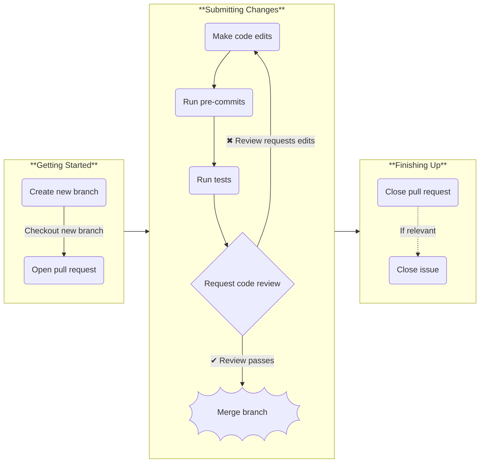

# How to contribute

OSOP welcomes contributions by users to help develop the toolkit in line with their user needs.

This page lists the guidelines for contributors which will help ease the process of getting your hard work accepted back into
the OSOP repository.

The developer workflow should be as follows:



## Getting started

> [!TIP]
> If you've not already got one, sign up for a [GitHub account](https://github.com/signup/free)

1. Create a new fix/feature branch: we use a [Feature Branch Workflow](https://info201.github.io/git-collaboration.html).
2. Open a draft pull request that will contain your changes.

> [!WARNING]
> Remember to checkout your new branch **before** your start committing code.

## Submitting changes

1. Make your changes and remember to add appropriate documentation and tests to supplement any new or changed functionality.
2. <details><summary>Run pre-commit checks and tests</summary>
   
   ```shell
   $ pre-commit
   # Optionally re-add and re-commit changes made by pre-commit hooks 
   $ pytest .
   ```
   
4. If you're not already on it (and would like to be), please add yourself to the [contributors list](CONTRIBUTORS.md)
5. Mark your pull request as ready for review and request a code review.

> \[!NOTE]
> Note that you will automatically be asked to sign the [Contributor Licence Agreement](https://cla-assistant.io/OSFTools/osop/)
> (CLA), if you have not already done so.
   
4. We will review your code and request changes if necessary.
5. Once your changes pass code review, an admin will merge changes in the `master` branch.
> \[!WARNING]
> By default, contributors _will not_ be able to merge their own changes in the `master` branch.

## Finishing Up

1. Close your pull request, and...
2. Optionally, if your changes relate to a Issue, close the related Issue with comments detailing the related PR.

# Writing Tests
Tests are written using [pytest](https://docs.pytest.org/en/stable/).  

Code coverage statistics are calculated for each push to your new branch.  

Pull requests that do _not_ contain test for added code will be rejected.
