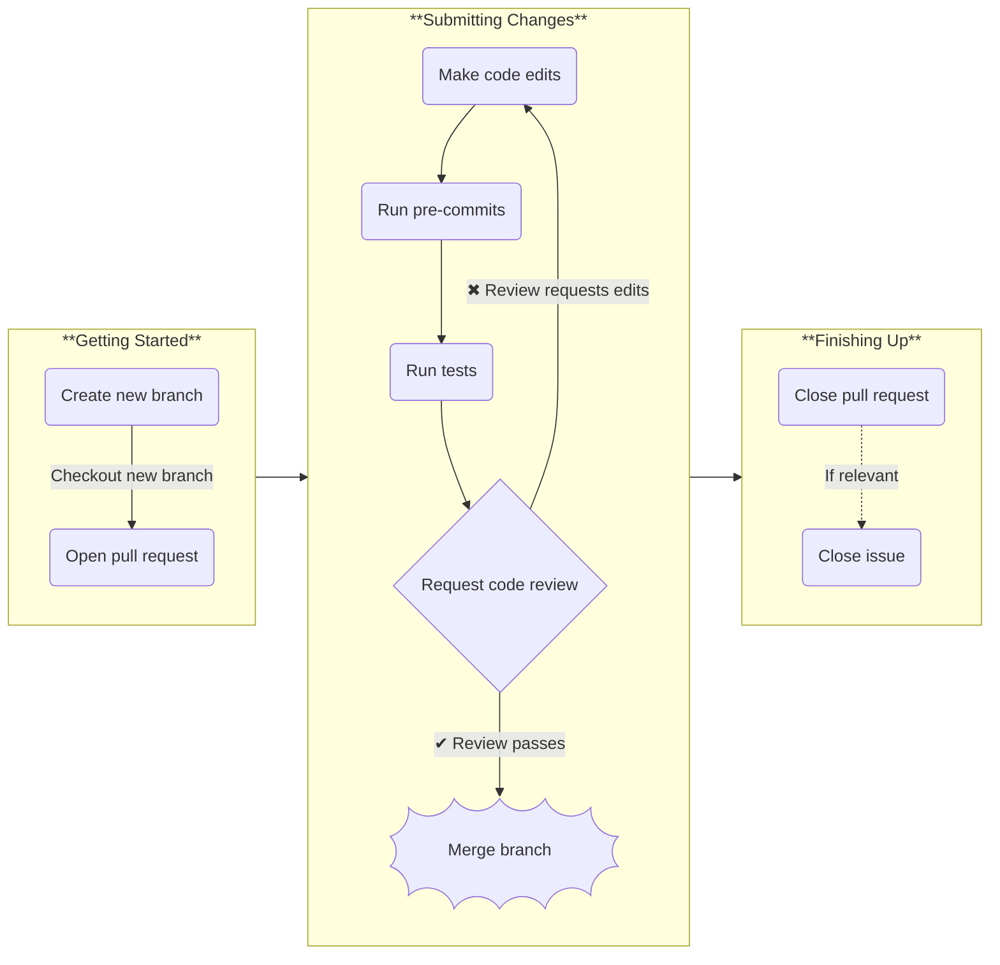

# How to contribute

OSOP welcomes contributions by users to help develop the toolkit in line with their user needs.

This page lists the guidelines for contributors which will help ease the process of getting your hard work accepted back into
the OSOP repository.

The developer workflow should be as follows:


```mermaid
---
config:
  theme: default
---
flowchart LR
subgraph gs [**Getting Started**]
    direction TB
    B(Create new branch ) --> |Checkout new branch| C(Open pull request)
    click B href "https://github.com/OSFTools/osop/branches" "Click to create new branch"
    click C href "https://github.com/OSFTools/osop/compare" "Click to create a PR"
end
gs --> sc
subgraph sc [**Submitting Changes**]
    direction TB
    D(Make code edits) --> D2(Run pre-commits) --> D3(Run tests)
    D3 --> E{Request code review}
    E --> | ✔ Review passes| F@{shape: bang, label: Merge branch}
    E --> | ✖ Review requests edits| D
end
    sc --> fu
subgraph fu [**Finishing Up**]
    direction TB
    G(Close pull request) -.-> |If relevant | H(Close issue)

end
```

## Getting started

> [!TIP]
> If you've not already got one, sign up for a [GitHub account](https://github.com/signup/free)

1. Create a new fix/feature branch: we use a [Feature Branch Workflow](https://info201.github.io/git-collaboration.html).
2. Open a draft pull request that will contain your changes.

> [!WARNING]
> Remember to checkout your new branch **before** your start committing code.

## Writing Tests
Tests are written using [pytest](https://docs.pytest.org/en/stable/).  

Code coverage statistics are calculated for each push to your new branch.  

Pull requests that do _not_ contain tests for added code will be rejected.

## Submitting changes

1. Make your changes and remember to add appropriate documentation and tests to supplement any new or changed functionality and update documentation if needed.
2. <details><summary>Run pre-commit checks and tests</summary>
   
   ```shell
   $ pre-commit
   # Optionally re-add and re-commit changes made by pre-commit hooks 
   $ pytest .
   ```
3. If you changed or added documentation, the docs can be built locally
by activating the osop conda environment and typing `cd docs/`, then
`make html`. The built HTML docs will be found at
`docs/build/html/index.html`. Open this in a browser and check your
changes work as intended. When your Pull Request is merged the
GitHub pages version will be automatically updated.
   
4. If you're not already on it (and would like to be), please add yourself to the [contributors list](CONTRIBUTORS.md)
5. Mark your pull request as ready for review and request a code review.

> \[!NOTE]
> Note that you will automatically be asked to sign the [Contributor Licence Agreement](https://cla-assistant.io/OSFTools/osop/)
> (CLA), if you have not already done so.
   
6. We will review your code and request changes if necessary.
7. Once your changes pass code review, an admin will merge changes in the `master` branch.
> \[!WARNING]
> By default, contributors _will not_ be able to merge their own changes in the `master` branch.

## Finishing Up

1. Close your pull request, and...
2. Optionally, if your changes relate to a Issue, close the related Issue with comments detailing the related PR.

# Release Process

Only maintainers with write access to the repository can create releases.

1. **Create a release branch** from an up-to-date `main`:
   ```shell
   git checkout main && git pull --ff-only origin main
   git checkout -b release/vX.Y.Z
   ```

2. **Bump the version** in [`docs/source/conf.py`](docs/source/conf.py):
   ```python
   release = "X.Y.Z"
   ```

3. **Commit, push, and open a PR** targeting `main`:
   ```shell
   git add docs/source/conf.py
   git commit -m "Bump version to X.Y.Z"
   git push origin release/vX.Y.Z
   gh pr create --base main --title "Release vX.Y.Z" --body "Bump version string for release."
   ```

4. **After the PR is reviewed and merged**, tag the merge commit on `main`:

   ```shell
   git checkout main && git pull --ff-only origin main
   git tag -a vX.Y.Z -m "OSOP vX.Y.Z"
   git push origin vX.Y.Z
   ```

   Pushing the tag triggers the CI test workflow (`ci-test-coverage`).

5. **Create the GitHub Release** from the tag:

   ```shell
   gh release create vX.Y.Z --title "vX.Y.Z" --generate-notes
   ```

   Or use the GitHub UI: **Releases → Draft a new release → choose tag `vX.Y.Z`**.

> [!NOTE]
> Tags must match the pattern `vX.Y.Z` (e.g. `v0.2.0`). Direct pushes to `main` are not permitted; all version changes must go through a pull request.