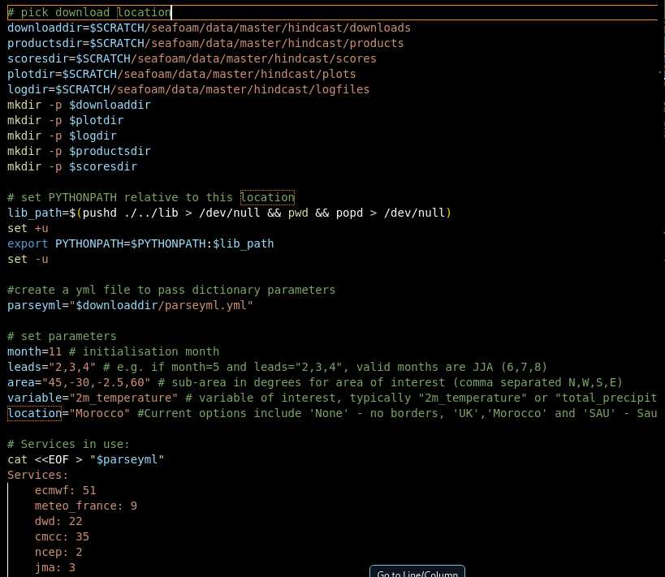

# Running the toolkit

Comprehensively at this stage the toolkit should be downloaded and
with basic access. Inside the Gitbash terminal, navigating to the
osop-main file and typing `ls` should bring up a list of directories
contained within the toolkit. Go into *scripts* with `cd scripts` and
type `ls` again. Here there should be a few shell scripts -- named
along the lines of `master.sh` or similar. These are the entry level
scripts discussed in the opening section.

To get these to run effectively we need to start with approval of
licensing for downloads from the Copernicus Climate Data Store.
[Climate Data Store](https://cds.climate.copernicus.eu/#!/home). To do
so follow the link below, create an account and re-inact the
instructions on the page.\
[CDSAPI setup - Climate Data
Store](https://cds.climate.copernicus.eu/how-to-api). This generally
amounts to creating an account, creating a text file with your unique
Key and the URL. Creating another textfile with the basic download
script and pip installing the cdsapi package before running the python
download script.

Once completing this stage the shell scripts should now work - even if
the steps come out as fails. Go to your Gitbash terminal and navigate
back to the scripts directory. Type `./master.sh -t` and press
enter. This runs the main script in a test mode with a limited set of
models. From here on out the script should run. If you receive an error
at this point please proceed below to the common errors section. Some
errors may be expected due to operating system dependencies, and these
can be smoothed out below.  

## Making Changes

The script as downloaded should be informally set up for basic use.
This is to say that it will probably run to create hindcast and
forecast verification and charts for a specified time frame, location
and variable. However, it is in the nature of the toolkit as well as
forecasting that these things will want to be specified by a user to
extract the information that is pertinent to their use case.

To do this we will want to start with the master.sh file. The first
step here is to open the file which can be found under the scripts
section of the osop toolkit. It does not matter how this is opened.
One option for people who have followed this text up to this point is
to open it with nano from a terminal as was done earlier in 2b.ii.

Once open -- near the start of this script will be a set out of
variables. They will appear in the bashformatt as follows.

This is the part of most importance. As this is the direct locations
to change for a base user to return a output that is of significant
use.

The parts labelled `"name"dir =
\$SCRATCH/seafoam/data/master/hindcast/"name"` is where the plots will
be stored. Scratch is generally recommended as computers are more
often than not set up to keep these as temporary files. If the files
are to be stored for more permeant usage. It would be worth changing
this to something more appropriate.

The next section marked `"month="` and so on is the variables section.
This will allow you to set the base parameters for your desired
outcome. I.E. changing the month= to month=5 will set the
initialisation month to May. It is important here that spaces that are
not already there are not added by the user as this will cause an
error. Do not for example write `"month = 5"`.

Here is a breakdown of options that can be changed and what they
represent.

- `month` -- This is the initialisation month. It should be an integer
  value between 1 and 12.

- `leads` -- This is the lead times. 2,3,4 with a initialisation month
  of 5 will give you June, July and August. The initialisation month
  is counted as 1. Theoretically this can be many integer values,
  however you need to think carefully about skill and use case before
  wanting further into the future.

- `area`-- This is the area spans. This should be a Lat, Lon value
  that covers the domain you wish to focus on. It is coordinated NWSE
  and that should be taken into account before changing.

- `variable` -- This is the factor that is to be looked at with the
  forecast. Options currently included as standard are 2m_temperature
  and total_precipitation.

- `location` -- This is the border POV for the plotting maps. If no
  borders are desired, leave blank or type None. This is suggested as
  standard.

After this is set up into a configuration that matches your preference
it is worth checking over the Services list. Here you will need to
check two things. A) The service you would like to use is included and
B) that the system version is correct for the time frame and use case.
Generally, you want to be on the latest version. However, some systems
do not run historic years until the month is reached for the new
model. As such checking the data is available on ECMWF is advised.

With these changes the system should be ready to run. Type
`./master.sh` in the terminal and keep an eye on the output. Once
complete the plots should be available in the dedicated directory.
This will give you the hindcast verification for your set up. To run
the forecast, the same changes should be made to master.forecast.sh
and then the forecast shell should be run in the terminal with
`./master.forecast.sh`.

## Viewing Outputs

At this stage you will probably want to review the output of your
work. To do this you will need to go to the designated place that you
have stored them within. If this was left untouched it will be the
\$SCRATCH directory under seafoam.

You can do these one of two ways, but the route via terminal is what
we will lay out here. Type `cd
$SCRATCH/seafoam/data/master/hindcast/plots` and then type `ls`. This
will bring up a list of appropriate plots. From here copy a file name
and type `code "pastefile"` before entering onwards. This should bring
up an image output.

If you receive an error and want to debug it, you may wish to see the
logfiles. To do that you can go to `cd
$SCRATCH/seafoam/data/master/hindcast/logfiles`. This is where output
of the code is stored for checking each time it is run. If an error is
received it will be captured here. It can be accessed the same way as
the image plots.

Forecasts are stored in a slightly different location if nothing has
been changed by user inputs `cd
$SCRATCH/seafoam/data/master/forecasts/plots`
