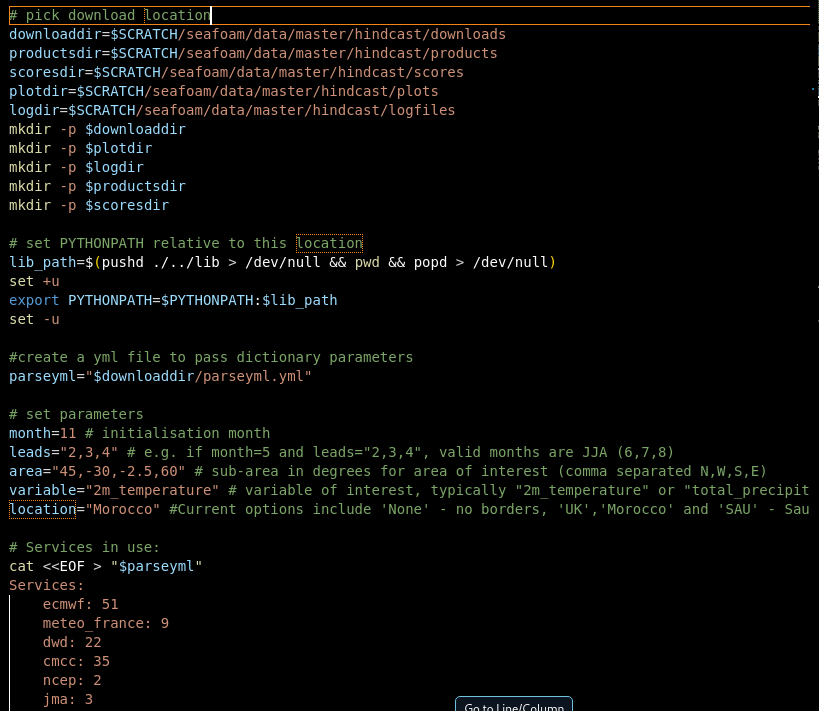

# OSOP User Guide
```{eval-rst}
.. toctree::
   :maxdepth: 2
   :caption: Contents:
```

## Set up and using the Objective Seasonal Outlook Package (OSOP)

### 1. Introduction

This document provides guidance on using the Objective Seasonal
Outlook Package (OSOP) toolkit for producing seasonal based
forecasting and verification. The text, as laid out here, is a
baseline for how to get started with the package. As such, the user
can modify or change the OSOP toolkit away from what is suggested here
as needed to suit their requirements. This document is based on the
latest version of the OSOP toolkit updated as of September 15th. Any
future changes to the toolkit by the producers may affect this
guidance document. It is recommended to regularly update the toolkit
locally to ensure that it is in sync with the main remote branch and
includes all recent changes. Guidance on how to do this can be found
in Appendix 1.

The package consists of a "driver script" structure. That is to say a
few top-level entry point scripts that orchestrate smaller pipeline
scripts. These smaller scripts have modular functions that can be used
in turn to produce hindcast verification, single service forecasts and
multi-model forecasts for varying regions and timespans. The modular
functions are written in python, with this holding up the base of the
toolkit. The top-level entry is written in a combination of bash
scripting and yaml to allow for simple execution and variable
management.

With all of this in consideration the user does not need to be
"fluent" in coding or these specific languages to get coherent use of
the OSOP toolkit. It is designed that after set-up, its base usage is
easy and comprehensible as well as versatile enough to cover the main
directives of the product. Users more advanced in coding may find that
they can edit further down in the software to get more highly specific
use cases. As outlined in the appendix, it is encouraged that if this
is done the ideas or solved selection of code should be pushed back up
to the main repository so that others can benefit from the same
changes. Similarly, if a user feels they have identified a need that
is not quite encapsulated within the product but does not feel they
have the skillset to handle them, then these issues should be posted
on the GitHub board to seek advice or for developers to take on.

### 2.  **Basic set up:**

For common users of code or developers within code frameworks, this
guide may cover redundant ideals. As such a brief overview of what is
included within this section is as follows; download and set up for a
package management system (Conda, in this case supported by
Miniforge), download and set up of Gitbash, mirroring of a repository
and finally environment installation. It would be expected that most
common coders have some or all of the considerations covered within
this section and as such it would be advised to move ahead. If issues
later present in installation and running of the OSOP toolkit it may
be pertinent to recheck this section for guidance.

### **2a. Installation of Miniforge:**

Conda is an open-source packet management system that is used to
install, maintain and handle software tools generally falling within
the realm of coding spaces. Miniforge is a lightweight installer for
Conda that is community-lead and openly licensed. It is not
necessarily the most user-friendly software; however, its minimalist
system ensures that it doesn't requisite heavily on system
requirements and avoids clutter from larger installers like Anaconda.
To be able to set up and get full functionality of the OSOP toolkit, a
package management software is needed to set up the environments
needed for the toolkit to run as well as maintain the modules long
term.

Guidance for setting up Miniforge can be found here:
[conda-forge/miniforge: A conda-forge
distribution.](https://github.com/conda-forge/miniforge)

It would be recommended here to follow through with the advice laid
out by the Miniforge developers for your specific situation. Miniforge
is the underpinning software that allows functionality of everything
else to come, so taking time here to get things smoothly working is
advised.

### **2b. Installation of Git:**

Git is a version control system that allows for multiple developers to
work on one project simultaneously without interference. Meanwhile,
Gitbash is emulator system that allows for communication with Git
services whilst enabling functionality of Unix based features. This
set up is based in two parts. One is the installation, and the other
is integration with Miniforge.

### **2b.i. Installation:**

It is important that during the installation of Git, Gitbash is
selected within this process. Otherwise set up systems are up to the
user's discretion.

Download of Git can be found here: [Git -
Downloads](https://git-scm.com/downloads)

Guidance for setting up Git can be found here: [Git Guides - install
git](https://github.com/git-guides/install-git)

Git is the main system for later downloading and mirroring the
repository that contains the OSOP toolkit. It is also the "missing
piece" in allowing for full functionality of the product, issues with
running the baseline product -- especially on windows system, may be
traced back here.

### **2b.ii. Cross functionality with Miniforge:**

Git does not necessarily function with Conda out the gate. Before
setting up the toolkit Git needs to be configured with Conda so that
packages can be loaded within the Git space.

The first check here is to see if its configured to work from
download. Open a Gitbash terminal via the search bar at the bottom --
type Git bash and it should come up. Upon completion a terminal should
appear. Typing `conda --version` will result in two options. The first
means that Git is configured with conda straight away, this will be if
it displays something along the lines of conda 25.3.1. The other
option is that it returns conda command not found, this means that
conda is not added to the systems PATH.

To fix this issue the following is advised. Type `nano ~/.bashrc` and
enter onwards. A text file system should appear. At the bottom of this
document (it may be blank upon opening, just type from there) place in
the following lines:

```
. "/c/Users/\<username\>/miniforge3/etc/profile.d/conda.sh"

conda activate base
```

**note replace \<username\> with the user of the OS.**

From here press ctrl + x, followed by y and then the enter key. Exit
Gitbash, open it again and type `conda --version`, this should now
work and return a conda 25.3.1 or similar.

This is the final step in software downloads that will underpin the
OSOP toolkit. Most of what is outlined here is necessary to run
python-based repositories from GitHub. Here onwards is about settling
in the OSOP product before finally being able to customise it to your
specific usage case.

### **2c. Mirroring the repository or Downloading:**

The baseline guidance here is to download the repository as a zip file
and extract. To do this go to this link [OSFTools/osop: Objective
Seasonal Outlooks Package](https://github.com/OSFTools/osop/) and
press on the green button that says code. Follow through with download
as ZIP on the drop-down box that appears. Once downloaded open up
Gitbash, and navigate to the download. This will usually be a case of
typing cd Downloads + enter, then ls and enter to confirm that you can
see a osop-main.zip file. From here type `extract osop-main.zip` and
enter onwards. This should create a osop-main/ file that can be looked
into and no longer has the .zip suffix.

Alternatively you can mirror the repository. Mirroring a repository is
what is generally considered to be a shallow copy of the original.
This is to mean that it copies the system locally but without certain
abilities in place. Most base level users should find that mirroring
is plenty for straight forward level usage and manipulation of the
code. However, developers or users interested in furthering the code
may want to consider forking the repo instead.

Guidance for mirroring a repository can be found here: [Duplicating a
repository - GitHub
Docs](https://docs.github.com/en/repositories/creating-and-managing-repositories/duplicating-a-repository?r292)

The specific repo can be found here: [OSFTools/osop: Objective
Seasonal Outlooks Package](https://github.com/OSFTools/osop/)

At this stage the repository is now handleable locally. The user
should take a moment to gather bearings and explore the functionality
of what has been done so far. Check that Conda is accessible within
Gitbash, and that tour around the repository to get a gist of layout
and location.

### **2d. Installing the environment:**

The final step in running the OSOP toolkit is to set up the
dependencies of the python code within the package. The dependencies
are modules that allow python code to function. They are essentially
shorthand for larger code that has been written and saved out by a
developer to allow for more code to be written that utilises these
base tools. The dependency of a project is usually included in the
"environment.yml" file found in most repositories. The first step will
be navigating within the osop-main file discussed in section 2c. This
is usually a case of `cd osop-main` within the directory that holds
this. If following the download zip section then this will be in
downloads. Typing `ls` will bring up a list of the files contained
here. One of which should be the environment.yml

Guidance for installing and activating an environment from a yaml file
can be found here: [Managing environments --- conda 25.7.1.dev65
documentation](https://docs.conda.io/projects/conda/en/latest/user-guide/tasks/manage-environments.html)
under the "*Creating an environment from an environment.yml file*"
subheading.

This concludes the set-up process of the OSOP toolkit. The next
section is to outline running the toolkit and then finally exploring
how to get the best usage out of it for your specific needs.

### 3.  **Running the toolkit:**

Comprehensively at this stage the toolkit should be downloaded and
with basic access. Inside the Gitbash terminal, navigating to the
osop-main file and typing `ls` should bring up a list of directories
contained within the toolkit. Go into *scripts* with `cd scripts` and
type `ls` again. Here there should be a few shell scripts -- named
along the lines of `master.sh` or similar. These are the entry level
scripts discussed in the opening section.

To get these to run effectively we need to start with approval of
licensing for downloads from the Copernicus Climate Data Store.
[Climate Data Store](https://cds.climate.copernicus.eu/#!/home). To do
so follow the link below, create an account and re-inact the
instructions on the page.\
[CDSAPI setup - Climate Data
Store](https://cds.climate.copernicus.eu/how-to-api). This generally
amounts to creating an account, creating a text file with your unique
Key and the URL. Creating another textfile with the basic download
script and pip installing the cdsapi package before running the python
download script.

Once completing this stage the shell scripts should now work - even if
the steps come out as fails. Go to your Gitbash terminal and navigate
back to the scripts directory. Type `./master.test.sh` and press
enter. From here on out the script should run. If you receive an error
at this point please proceed below to the common errors section. Some
errors may be expected due to operating system dependencies, and these
can be smoothed out below.

### 4.  **Making Changes:**

The script as downloaded should be informally set up for basic use.
This is to say that it will probably run to create hindcast and
forecast verification and charts for a specified time frame, location
and variable. However, it is in the nature of the toolkit as well as
forecasting that these things will want to be specified by a user to
extract the information that is pertinent to their use case.

To do this we will want to start with the master.sh file. The first
step here is to open the file which can be found under the scripts
section of the osop toolkit. It does not matter how this is opened.
One option for people who have followed this text up to this point is
to open it with nano from a terminal as was done earlier in 2b.ii.

Once open -- near the start of this script will be a set out of
variables. They will appear in the bashformatt as follows.



This is the part of most importance. As this is the direct locations
to change for a base user to return a output that is of significant
use.

The parts labelled `"name"dir =
\$SCRATCH/seafoam/data/master/hindcast/"name"` is where the plots will
be stored. Scratch is generally recommended as computers are more
often than not set up to keep these as temporary files. If the files
are to be stored for more permeant usage. It would be worth changing
this to something more appropriate.

The next section marked `"month="` and so on is the variables section.
This will allow you to set the base parameters for your desired
outcome. I.E. changing the month= to month=5 will set the
initialisation month to May. It is important here that spaces that are
not already there are not added by the user as this will cause an
error. Do not for example write `"month = 5"`.

Here is a breakdown of options that can be changed and what they
represent.

- `month` -- This is the initialisation month. It should be an integer
  value between 1 and 12.

- `leads` -- This is the lead times. 2,3,4 with a initialisation month
  of 5 will give you June, July and August. The initialisation month
  is counted as 1. Theoretically this can be many integer values,
  however you need to think carefully about skill and use case before
  wanting further into the future.

- `area`-- This is the area spans. This should be a Lat, Lon value
  that covers the domain you wish to focus on. It is coordinated NWSE
  and that should be taken into account before changing.

- `variable` -- This is the factor that is to be looked at with the
  forecast. Options currently included as standard are 2m_temperature
  and total_precipitation.

- `location` -- This is the border POV for the plotting maps. If no
  borders are desired, leave blank or type None. This is suggested as
  standard.

After this is set up into a configuration that matches your preference
it is worth checking over the Services list. Here you will need to
check two things. A) The service you would like to use is included and
B) that the system version is correct for the time frame and use case.
Generally, you want to be on the latest version. However, some systems
do not run historic years until the month is reached for the new
model. As such checking the data is available on ECMWF is advised.

With these changes the system should be ready to run. Type
`./master.sh` in the terminal and keep an eye on the output. Once
complete the plots should be available in the dedicated directory.
This will give you the hindcast verification for your set up. To run
the forecast, the same changes should be made to master.forecast.sh
and then the forecast shell should be run in the terminal with
`./master.forecast.sh`.

### 5.  **Viewing Outputs:**

At this stage you will probably want to review the output of your
work. To do this you will need to go to the designated place that you
have stored them within. If this was left untouched it will be the
\$SCRATCH directory under seafoam.

You can do these one of two ways, but the route via terminal is what
we will lay out here. Type `cd
$SCRATCH/seafoam/data/master/hindcast/plots` and then type `ls`. This
will bring up a list of appropriate plots. From here copy a file name
and type `code "pastefile"` before entering onwards. This should bring
up an image output.

If you receive an error and want to debug it, you may wish to see the
logfiles. To do that you can go to `cd
$SCRATCH/seafoam/data/master/hindcast/logfiles`. This is where output
of the code is stored for checking each time it is run. If an error is
received it will be captured here. It can be accessed the same way as
the image plots.

Forecasts are stored in a slightly different location if nothing has
been changed by user inputs `cd
$SCRATCH/seafoam/data/master/forecasts/plots`

### 6.  **Development:**

From here users are welcome to interact and play around with the
toolkit as much as desired. If significant changes are made, and a
user feels they would be of use to the overall community, it is
encouraged for these changes to be pushed up to the Git repo.
Alternatively, suggestions can be made and if applicable and time
permits, users may pick these up to work on within the community.
